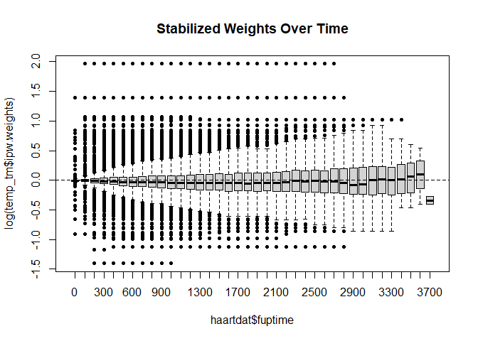

ipw: Estimate Inverse Probability Weights
================

# ipw 

The `ipw` package provides a flexible toolkit for estimating **Inverse
Probability Weights (IPW)** to fit marginal structural models. Functions
to estimate the probability to receive the observed treatment, based on
individual characteristics. The inverse of these probabilities can be
used as weights when estimating causal effects from observational data
via marginal structural models. Both point treatment situations and
longitudinal studies can be analysed. The same functions can be used to
correct for informative censoring.

## Key Features

- **Point Treatment & Longitudinal Data**: Functions to handle both
  static exposures and time-varying confounding.
- **Wide Range of Models**: Support for binomial, multinomial, ordinal,
  and continuous (Gaussian) exposures.
- **Survival Analysis**: Integration with Cox proportional hazards
  models for time-to-event data.
- **Diagnostic Tools**: Built-in plotting functions to assess weight
  stability and the positivity assumption.

## Installation

``` r
install.packages("ipw")
```

## Example: Point Treatment Causal Inference

This example simulates data with a continuous confounder (`l`) and a
binomial exposure (`a`) to estimate a marginal causal effect of 10.

``` r
library(ipw)
library(survey)

# 1. Simulate data
set.seed(123)
n <- 1000
simdat <- data.frame(l = rnorm(n, 10, 5))
a.lin <- simdat$l - 10
pa <- exp(a.lin)/(1 + exp(a.lin))
simdat$a <- rbinom(n, 1, prob = pa)
simdat$y <- 10*simdat$a + 0.5*simdat$l + rnorm(n, -10, 5)

# 2. Estimate IPW weights
temp <- ipwpoint(
   exposure = a,
   family = "binomial",
   link = "logit",
   numerator = ~ 1,
   denominator = ~ l,
   data = simdat)

# 3. Fit Marginal Structural Model (MSM)
msm <- svyglm(y ~ a, 
              design = svydesign(~1, weights = ~temp$ipw.weights, data = simdat))

summary(msm)
#> 
#> Call:
#> svyglm(formula = y ~ a, design = svydesign(~1, weights = ~temp$ipw.weights, 
#>     data = simdat))
#> 
#> Survey design:
#> svydesign(~1, weights = ~temp$ipw.weights, data = simdat)
#> 
#> Coefficients:
#>             Estimate Std. Error t value Pr(>|t|)    
#> (Intercept)  -6.2885     0.2757  -22.81   <2e-16 ***
#> a            10.6622     0.8083   13.19   <2e-16 ***
#> ---
#> Signif. codes:  0 '***' 0.001 '**' 0.01 '*' 0.05 '.' 0.1 ' ' 1
#> 
#> (Dispersion parameter for gaussian family taken to be 22.76977)
#> 
#> Number of Fisher Scoring iterations: 2
```

## Example: Time-Varying Weights

For longitudinal research, such as analyzing **TBM** data, `ipwtm`
calculates the cumulative product of weights over time.

``` r
library(ipw)
library(survival)

data(haartdat)

# Estimate time-varying weights for HAART initiation
temp_tm <- ipwtm(
  exposure = haartind,
  family = "survival",
  numerator = ~ sex + age,
  denominator = ~ sex + age + cd4.sqrt,
  id = patient,
  tstart = tstart,
  timevar = fuptime,
  type = "first",
  data = haartdat
)

# Visualize weight stability
ipwplot(weights = temp_tm$ipw.weights, timevar = haartdat$fuptime, 
        binwidth = 100, main = "Stabilized Weights Over Time")
```



## Authors

- **Hung Thai Tran** - Research Assistant, Biostatistics Group at OUCRU.
- **Willem M. van der Wal** - Original Author.
- **Ronald B. Geskus** - Head of Biostatistics, OUCRU.

## References

- Van der Wal W.M. & Geskus R.B. (2011). ipw: An R Package for Inverse
  Probability Weighting. *Journal of Statistical Software*, **43**(13),
  1-23.
- Robins J.M., Hernán M.A. & Brumback B.A. (2000). Marginal structural
  models and causal inference in epidemiology. *Epidemiology*, **11**,
  550-560.
